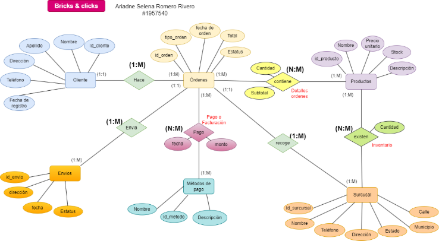
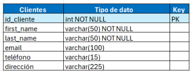
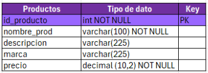
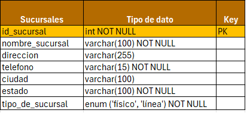
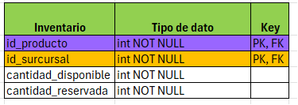
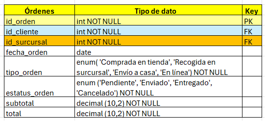
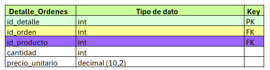
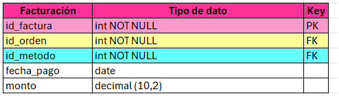
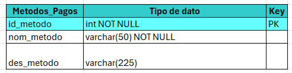
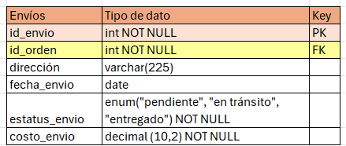

Ariadne Selena Romero Rivero
Universidad Autónoma de Nuevo León
Facultad Ciencias Físico Matemáticas

# Introducción
El **modelo Bricks & Clicks** es una estrategia empresarial que integra la venta en **tiendas físicas** (Bricks) con la venta en **plataformas digitales** (Clicks). Este enfoque permite a las empresas ofrecer una experiencia de compra más completa y accesible, aprovechando las ventajas de ambos canales. En un mundo donde los consumidores buscan conveniencia y variedad, este modelo se ha vuelto cada vez más relevante, ya que opera tanto un establecimiento físico como una tienda en línea, lo que les permite llegar a un público más amplio y adaptarse a las preferencias cambiantes de los consumidores.

La siguiente base de datos elabora en función a que el cliente puede realizar compras de diversos productos ya sea de manera presencial en una sucursal, como de manera virtual, asimismo el cliente puede decidir si el producto llega a la dirección de su hogar o buscarlo en una sucursal. A través de esta base de datos se busca tener un registro de todos los clientes, el historial de compras por cada cliente y sucursal, las facturaciones, envíos, los productos que se encuentran a la venta y el inventario, cumpliendo con el control de una pequeña empresa que empieza a implementar el modelo Bricks & Clicks, en la que planeo utilizar los conocimientos que he adquirido durante el curso.

# Diagrama entidad-relación de la base de datos
A continuación, se muestra el diagrama entidad relación del modelo Bricks & Clicks, en el cual busca satisfacer el principal giro de este modelo.

Principalmente este diagrama consta de las entidades: Cliente, Órdenes, Productos, Envíos, Métodos de pago y sucursal, todas estas estas entidades se relacionan de manera 1 a muchos, y muchos a muchos, para este último caso se crearán tablas para lograr estas relaciones. 
# Descripción de tablas
Seguidamente, se mostrarán las tablas que forman parte de la base de datos, inspirada en el modelo entidad relación anteriormente mostrado. Como se puede observar existen tablas que salen de la unión de mucho a muchos, entre otras tablas, estas uniones dentro del modelo se les dio un nombre por encima, sin embargo, en esta sección se le dará una descripción más detallada:

## Tabla Clientes
Esta **entidad** almacena la información de los clientes que realizan compras tanto en tiendas físicas como en línea**.** Esta tabla contiene los campos de nombre de los clientes, email, telefono, dirección y por último su respectivo identicador.

## Tabla Productos
Esta tabla contiene toda la información de los productos, como lo es el nombre del producto, una breve descripción de este, marca, precio y su identificador

## Tabla Sucursales
Esta tabla almacena la información sobre las diferentes sucursales tanto físicas como en línea de la empresa, permitiendo gestionar su ubicación y detalles relevantes.

## Tabla Inventario
Esta tabla contiene información sobre la disponibilidad y reservas de productos en cada una de las sucursales. Esta tabla nace de la relación muchos a muchos de surcursales y productos. La tabla contiene una clave concatenada, el cual une el id\_producto y id\_surcursal con el fin de identificar que productos hay entre cada surcursal, además de contar con la catidad disponible en el inventario y la cantidad reservada que se encuentra para los pedidos hechos de cada producto.

## Tabla Órdenes
Registra los pedidos realizados por los clientes, ya sea en línea o en una surcursal física.

### Campos:
- **id\_orden (Clave primaria): INT** 
- **id\_cliente (Clave foránea): INT -** Referencia al cliente que realiza el pedido, vinculado a la tabla Clientes.
- **fecha\_orden: DATE** 
- **tipo\_orden ENUM(‘comprada en tienda’, ‘recogida en surcursal’, ‘envío a dirección’, ‘en línea’)** - Para este modelo yo defini 4 tipos de orden, que se pueden explicar en el siguiente cuadro:

||Tipo de orden|Pago|Recoge|
| :- | :- | :- | :- |
|1|Comprada en sucursal|Sucursal|Sucursal|
|2|Recogida en sucursal|En línea |Sucursal|
|3|Envío a casa|Sucursal|Dirección|
|4|En línea|En línea|Dirección|

1. Comprada en tienda: El cliente realiza el pago en la sucursal y se lleva el producto ahí mismo de la sucursal.
1. Envío a dirección: Se realiza el pago en la sucursal, pero se enviar el producto hacia la dirección que el cliente indique.
1. Recogida a sucursal: El cliente hace el pedido en línea, pero recoge su producto en la sucursal escogida.
1. En línea: El cliente hace su pedido en línea y lo recibe a la dirección que el cliente indique.

- **estatus\_orden ENUM(‘pendiente’, ‘enviado’, ‘entregado’, ‘cancelado’) -** Enumera el tipo de estatus que se puede encontrar un paquete.
- **subtotal: DECIMAL(10, 2)** 
- **total: DECIMAL(10, 2) -** Total de transacción.

## Tabla Detalles -Órdenes
Esta tabla almacena los detalles de cada orden realizada por los clientes, incluyendo los productos y cantidades. Esta tabla cuenta con un identificador, dos llave foraneas hacia las tabla de orden y producto respectivamente, cantidad y el precio unitario del producto.

### Campos:
- **id\_orden (Clave foránea): INT -** Referencia al número de orden, vinculado a la tabla ordenes
- **id\_producto (Clave foránea): INT -** Referencia al producto, vinculado a la tabla de productos

## Tabla Facturación
Esta tabla contiene la información relacionada con la facturación de las órdenes, el monto y a que orden y metodo de pago hace referencia el cliente. 

### Campos:
- **id\_factura (Clave primaria): INT** 
- **id\_orden (Clave foránea): INT -** Referencia al número de orden, vinculado a la tabla ordenes
- **id\_metodo (Clave foránea): INT -** Referencia al tipo de metodo a utilizar, vinculado a la tabla Metodos\_Pago
- **fecha\_pago: DATE** 
- **monto: DECIMAL(10, 2) -** Total de transacción.

## Tabla Métodos\_Pago
Esta tabla almacena los metodos de pago con los que se puede pagar, también la fecha y el monto.

### Campos:
- **id\_metodo (Clave primaria) INT** 
- **Nom\_metodo: VARCHAR(50) -** Nombre del método
- **Des\_metodo: VARCHAR(225) -** Decripción del método

## Tabla Envíos
Esta tabla almacena los envios. El cliente elige a que dirección llegue su producto. Esta tabla cuenta con su identificador, el id\_orden que es una llave foranea que hace relación a la orden, dirección, fecha de envio, estuatus y el costo del mismo.

### Campos:
- **id\_envio (Clave primaria) INT**
- **id\_orden (Clave foránea): INT -** Referencia al número de orden, vinculado a la tabla ordenes
- **dirección: VARCHAR(225)**
- **fecha\_envio:** **DATE**
- **estatus\_envio ENUM(‘pendiente, ‘en tránsito’, ‘entregado’) -** Enumera el tipo de estatus que se puede encontrar un paquete.
- **Costo\_envio: DECIMAL(10, 2) –** Contiene solamente el costo de envio.

# Bibliografía
*¿Qué es una orden de compra y cómo hacerla?* (2024, September 9). https://quickbooks.intuit.com/global/resources/es/inventario/que-es-una-orden-de-compra-y-como-hacerla/

Simple, I. (2024, September 4). Orden de compra frente a factura: Explicación de las diferencias - Invoice Simple. Invoice Simple. https://www.invoicesimple.com/es/blog/purchase-order-vs-invoice

Fundamentos de Bases de Datos - Abraham Silberschatz, Henry Korth y S. Sudarshan (2011). McGraw Hill Interamericana.

